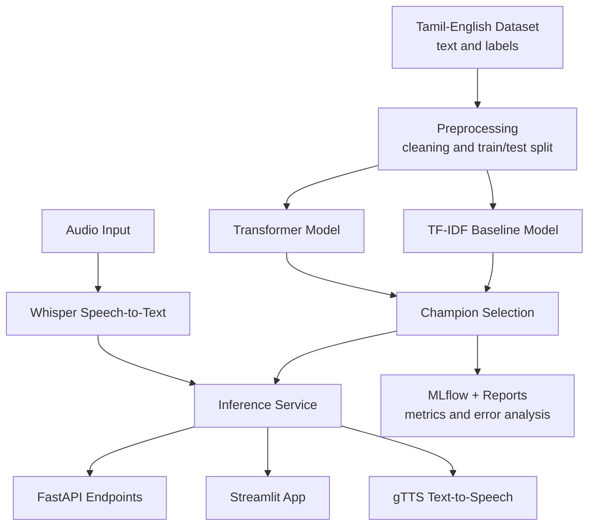

# Tamil-English NLP Intelligence Suite

**GitHub Repository:** [praveenraj9623-sketch/tamil-english-nlp-intelligence-suite](https://github.com/praveenraj9623-sketch/tamil-english-nlp-intelligence-suite)

> A multilingual NLP intelligence suite for Tamil-English sentiment analysis, baseline and transformer modeling, speech-to-text, text-to-speech, FastAPI serving, Streamlit demos, MLflow tracking, and error analysis.

[](https://python.org)
[](https://huggingface.co)
[](https://www.sbert.net)
[](https://github.com/openai/whisper)
[](https://fastapi.tiangolo.com)
[](https://streamlit.io)
[](https://mlflow.org)
[](https://praveenraj9623-sketch.github.io/)
[](https://github.com/praveenraj9623-sketch/tamil-english-nlp-intelligence-suite)

---

## What is This Project?

This project builds a multilingual Tamil-English NLP workflow for sentiment classification and speech utilities. It includes data preprocessing, TF-IDF baseline modeling, transformer-based modeling, inference helpers, speech-to-text, text-to-speech, API endpoints, dashboard interaction, and error analysis reports.

**Core outcome:** Tamil-English text/audio -> preprocessing -> NLP model inference -> sentiment prediction -> speech tools -> API/dashboard delivery -> error analysis.

---

## Dataset

The project references the Kaggle Tamil-English sentiment dataset:

https://www.kaggle.com/datasets/danushkumarv/sentiment-analysis-in-tamilenglish-text

---

## System Architecture



---

## Tech Stack

| Category | Tools & Libraries |
|---|---|
| Data Processing | Pandas, NumPy |
| NLP Baseline | scikit-learn, TF-IDF |
| Embeddings / Transformers | sentence-transformers, PyTorch |
| Speech-to-Text | openai-whisper |
| Text-to-Speech | gTTS |
| API | FastAPI, Uvicorn, python-multipart |
| Dashboard | Streamlit |
| Experiment Tracking | MLflow |
| Visualization | Matplotlib |
| Packaging | Docker, Docker Compose |

---

## API Endpoints

Start the API locally:

```bash
uvicorn api.main:app --reload --host 0.0.0.0 --port 8000
```

| Method | Endpoint | Purpose |
|---|---|---|
| `GET` | `/health` | Health check |
| `POST` | `/predict/sentiment` | Predict Tamil-English sentiment |
| `POST` | `/speech-to-text` | Convert speech to text |
| `POST` | `/text-to-speech` | Convert text to speech |

---

## Quick Start

```bash
git clone https://github.com/praveenraj9623-sketch/tamil-english-nlp-intelligence-suite.git
cd tamil-english-nlp-intelligence-suite
python -m venv .venv
.venv\Scripts\activate
pip install -r requirements.txt
streamlit run app.py
```

The local dashboard opens at:

```text
http://127.0.0.1:8501
```

---

## Docker Workflow

```bash
docker compose up --build
```

---

## Project Structure

```text
tamil-english-nlp-intelligence-suite/
|-- app.py
|-- Dockerfile
|-- docker-compose.yml
|-- requirements.txt
|-- api/
|-- data/
|-- demo/
|-- models/
|-- reports/
|-- scripts/
`-- src/
    |-- baseline_model.py
    |-- error_analysis.py
    |-- inference.py
    |-- preprocessing.py
    |-- speech_to_text.py
    |-- text_to_speech.py
    `-- transformer_model.py
```

---

## Key Outputs

| Output | Description |
|---|---|
| `models/champion_model.joblib` | Selected production-style sentiment model |
| `models/tfidf_baseline.joblib` | TF-IDF baseline model |
| `reports/baseline_metrics.json` | Baseline performance metrics |
| `reports/error_analysis.json` | Error analysis summary |
| `reports/error_analysis_top20.csv` | Highest-impact error examples |
| `demo/sample_tamil_gtts.mp3` | Demo text-to-speech output |

---

## Limitations

- Code-mixed Tamil-English language can be noisy and context-dependent.
- Speech-to-text quality depends on audio clarity and dialect coverage.
- Sentiment labels should be reviewed for production-grade moderation or customer analytics.

---

## Future Improvements

- Add larger code-mixed datasets.
- Fine-tune transformer models directly on Tamil-English text.
- Add model drift tracking for new slang and language patterns.
- Deploy the API and dashboard as separate production services.

---

## Author

Built by **Praveen Raj A**

- Portfolio: https://praveenraj9623-sketch.github.io/
- LinkedIn: https://www.linkedin.com/in/praveen-raj-a-b05abb2a3/
- GitHub: https://github.com/praveenraj9623-sketch
- Repository: https://github.com/praveenraj9623-sketch/tamil-english-nlp-intelligence-suite
